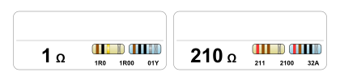

# forked from Finomnis/ResistorLabels

Changed it up a bit to read the values in from a json file

# ResistorLabels

This script generates labels for resistor zip bags.

It is meant for AVERY 5260 or AVERY L7157 labels and 7x10cm (3"x4") zip bags.

The generated labels include:

-   Resistor value
-   4- and 5-band color codes
-   3- and 4-digit smd codes
-   EIA-96 smd code

# Usage

change up the example json to the values and settings you want then run the exe, the script will generate a `ResistorLabels.pdf` that can be used to print onto AVERY 5260/L7157.

# More Details

This is based on an idea from Zach Poff.

For more details on how to use these labels, visit his website:

https://www.zachpoff.com/resources/quick-easy-and-cheap-resistor-storage/
